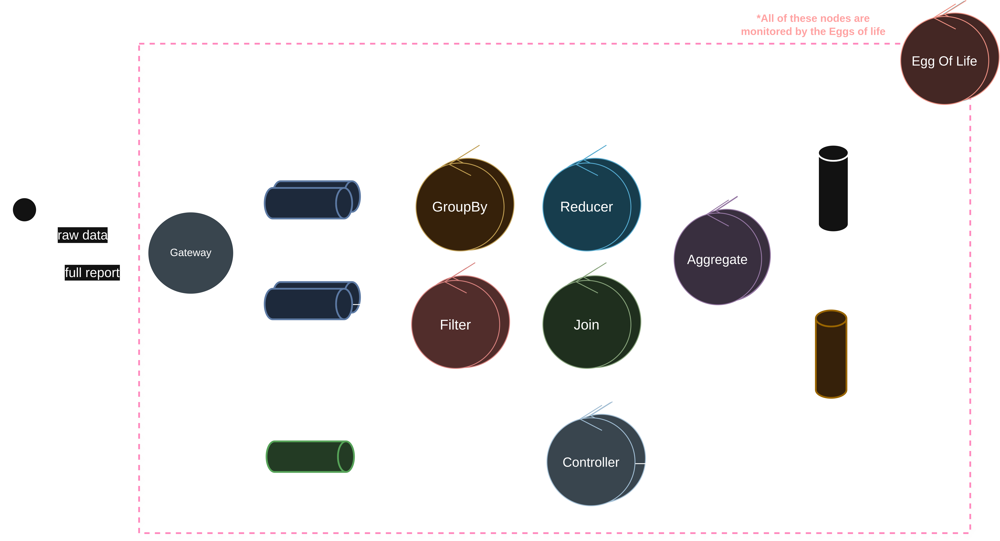

# Distributed System for Sales Analysis with Fault Tolerance & Horizontal Scalability

## Language

📖 **Available in**: [Español](./README.md) | English

| Team            |
| --------------- |
| Federico Genaro |
| Santiago Sevitz |
| Maximo Utrera   |

Architecture Documents:

-   [Submission I: Design](./docs/diseño.pdf)
-   [Submission II: Scalability](./docs/escalabilidad.pdf)
-   [Submission III: Multiclient](./docs/multiclient.pdf)
-   [Submission IV: Fault Tolerance](./docs/tolerancia.pdf)

## General Overview

This project presents the design of a **fault-tolerant distributed system** for analyzing sales data from a coffee shop chain in Malaysia. It was developed as a Practical Work for the **Distributed Systems I (FIUBA)** course and prioritizes **scalability, robustness, and distributed pipeline processing**.

The system enables processing large volumes of transactions sent by a client, applying complex transformations and aggregations, and returning consolidated reports while maintaining consistency even in the face of partial or catastrophic system failures.

---

## System Objectives

-   Process large transaction datasets in a distributed manner.
-   Support multiple analytical requirements (filtering, aggregation, ranking, joins).
-   Guarantee fault tolerance, duplicate handling, and idempotence.
-   Horizontal scaling independently for each node type.

---

## Datasets

The system primarily works with:

-   **Transactions** (multiple files)
-   **Transaction Items** (multiple files)

As reference data (for joins):

-   Menu Items
-   Stores
-   Users

Other datasets (Vouchers, Payment Methods) are not used as they are not necessary for the expected results.

---

## General Architecture

### Main Components

-   **Client**: sends data and receives reports.
-   **Gateway**: entry point to the system and unique interface with the client.
-   **Controller**: coordinates execution and controls transmission end.
-   **Workers**:

    -   Filter
    -   GroupBy
    -   Reducer
    -   Aggregator
    -   Joiner

-   **Middleware**: RabbitMQ as Message-Oriented Middleware.

Internal communication is conducted exclusively through **message queues**, enabling decoupling and parallelism.

---

## Data Processing (Pipelines)

The system uses the **Worker-per-filter** model, where each pipeline stage is isolated:

1. **Filter**: applies temporal and business criteria.
2. **GroupBy**: groups records by relevant keys.
3. **Reducer**: executes sums or counts.
4. **Aggregator**: consolidates batches and applies rankings (Top N).
5. **Joiner**: links processed data with reference datasets.

Each functional requirement defines a specific pipeline combining these stages.

---

## Execution Flow

1. Client requests a task from the Gateway.
2. Controller initializes the client control sequence.
3. Client sends reference datasets.
4. Client sends transaction batches.
5. Workers process data in a chained manner.
6. Aggregator consolidates results.
7. Joiner generates the final report.
8. Gateway returns the report to the client.

---

## Fault Tolerance

### Implemented Mechanisms

-   **Health Check (Egg of Life)**: monitoring via **UDP heartbeats** and automatic node restart.
-   **Deferred ACKs**: message re-queuing upon processing failures.
-   **Disk Persistence**:

    -   Joiner: reference datasets.
    -   Aggregator: processed batches.
    -   Controller: client state.

-   **Duplicate Handling**: sequence numbers for packets per client.
-   **Idempotent Messages**: especially for transmission end.

### Critical Components with Replicas

-   Gateway (Load balanced randomly)
-   Controller (Load balanced deterministically by client using a hash function)
-   Aggregator

---

## Leader Election (EOL)

The **Bully** algorithm was implemented to form a monitoring network among **Egg of life** nodes, ensuring the system does not depend on a single node for automatic restarts. Instead, they restart each other in case of failure. With the premise of low **maintainability**, this solution ensures that there will never be a lack of such nodes, thereby allowing recovery from an extreme system failure case (e.g., all workers, gateways, controllers, and egg of life nodes except one).

---

## Infrastructure and Deployment

-   RabbitMQ with persistent queues.
-   Workers deployed as Docker containers.
-   Horizontal scaling through replicas.
-   Orchestration with Docker Compose (in this case, but can be deployed on _Kubernetes_).

---

## Technologies Used

-   **Languages**: Go, Python
-   **Messaging**: RabbitMQ
-   **Serialization**: Protobuf
-   **Containers**: Docker
-   **Dataset**: Kaggle – Coffee Shop Transactions

---

## Component Documentation

### Nodes

-   [Client](./docs/client.md)
-   [Gateway](./docs/gateway.md)
-   [Controller](./docs/controller.md)
-   [Filter](./docs/filter.md)
-   [Group By](./docs/group_by.md)
-   [Reducer](./docs/reducer.md)
-   [Aggregator](./docs/aggregator.md)
-   [Joiner](./docs/joiner.md)
-   [Egg of Life](./docs/egg_of_life.md)

### Mechanisms

-   [Worker Common](./docs/worker_common.md)
-   [Middleware](./docs/middleware.md)
-   [EOF](./docs/EOF.md)

---

## References

-   [Kaggle: G Coffee Shop Transaction Dataset](https://www.kaggle.com/datasets/geraldooizx/g-coffee-shop-transaction-202307-to-202506)
-   [Validation Notebook FIUBA – Distributed Systems I](https://www.kaggle.com/code/gabrielrobles/fiuba-distribuidos-1-coffee-shop-analysis)
